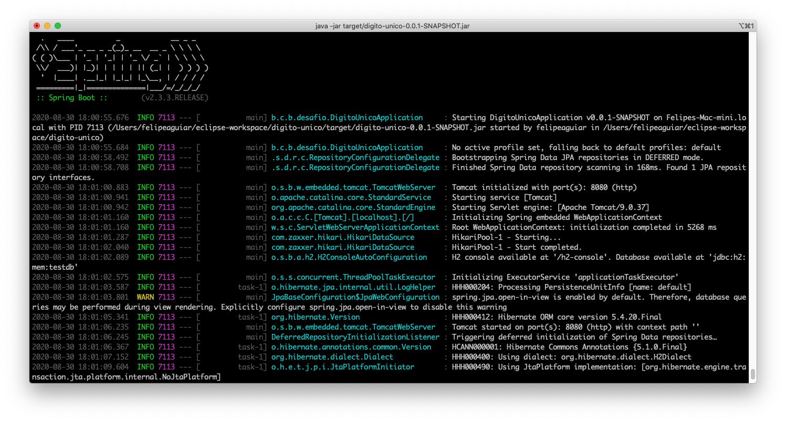
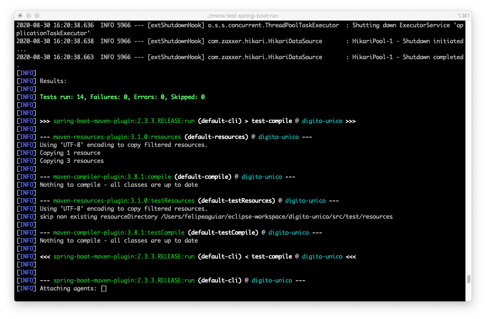
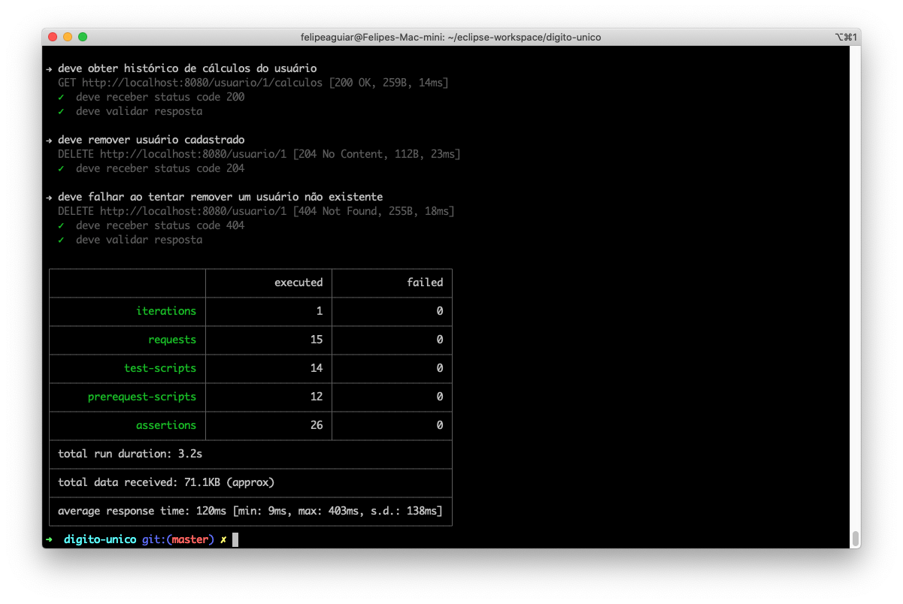
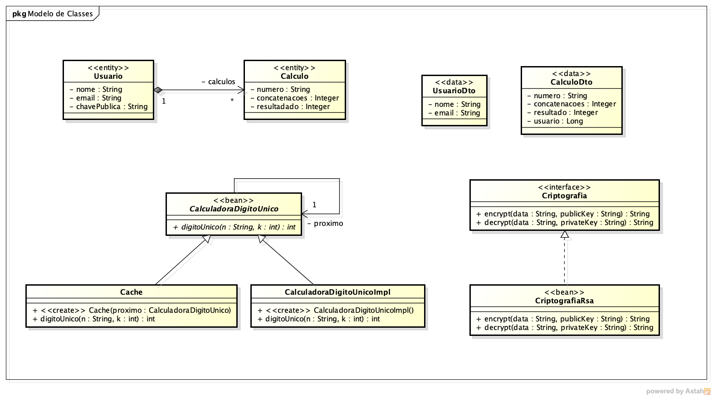

# Desafio Banco Inter - Dígito Único

## Requisitos

- CRUD de usuário - OK
- Cache em memória com os últimos 10 cálculos realizados - OK
- Criptografia do nome e email do usuário - OK
- Endpoint para recuperar cálculos do usuário - OK
- Testes unitários com JUnit - OK
- Testes integrados com Postman - OK
- Arquivo swagger com a especificação da API - OK

## Como Executar a Aplicação

Para executar a aplicação execute o comando abaixo na raiz do projeto. A aplicação iniciará na porta 8080.

```sh
./mvnw spring-boot:run
```


## Como Compilar a Aplicação

Para compilar a aplicação execute os comandos abaixo na raiz do projeto. 

```sh
rm -rf target
./mvnw package
```

Durante o build do projeto os testes unitários serão executados e será gerado um arquivo jar dentro do diretório target. Para iniciar a aplicação execute o comando abaixo.

```sh
java -jar target/digito-unico-0.0.1-SNAPSHOT.jar
```



## Como Executar os Testes

Para executar os testes unitários execute o comando abaixo na raiz do projeto.

```sh
./mvnw test spring-boot:run
```



Para executar os testes integrados importe o arquivo `postman_collection.json` no Postman, expanda o menu de contexto da collection e clique no botão Run. Será aberta uma janela de execução de testes, clique no botão Run Dígito Único para iniciar os testes.


Alternativamente, os testes integrados podem ser executados utilizando o terminal. Instale o Node.js e execute o comando `sudo npm install -g newman` para instalar o newman de forma global. Então, execute o comando abaixo na raiz do projeto.

```sh
newman run postman_collection.json
```



## Criptografia

Gerando um par de chaves com o OpenSSL. Execute os comandos abaixo para gerar um par de chaves RSA de tamanho 2048. A chave dentro do arquivo `publickey.crt` deverá ser enviada ao endpoint da API e será usada para criptografar os dados enviados para o usuário. A chave dentro do arquivo `pkcs8.key` deverá ser usada para descriptografar os dados recebidos da API.

```sh
openssl genrsa -out keypair.pem 2048
openssl rsa -in keypair.pem -pubout -out publickey.crt
openssl pkcs8 -topk8 -inform PEM -outform PEM -nocrypt -in keypair.pem -out pkcs8.key 
```

## Principais Classes

Abaixo um breve resumo das principais classes do projeto.


